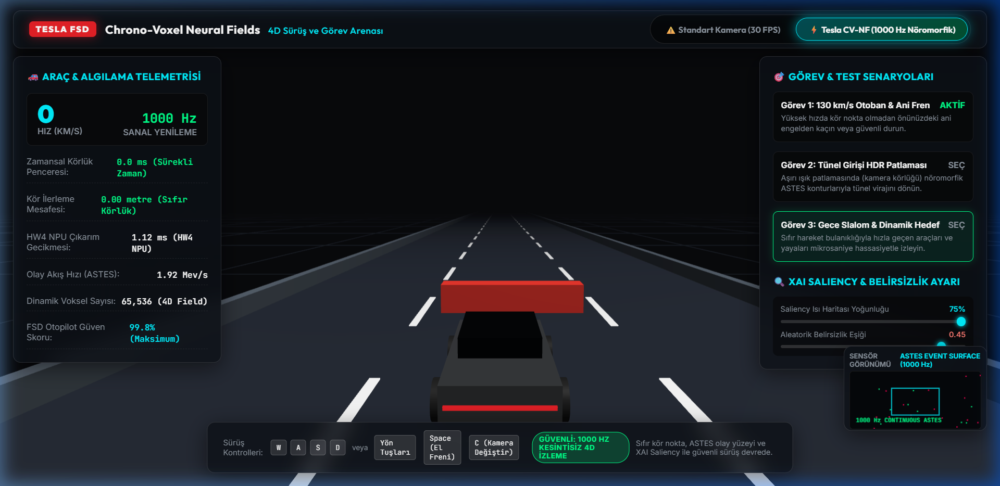
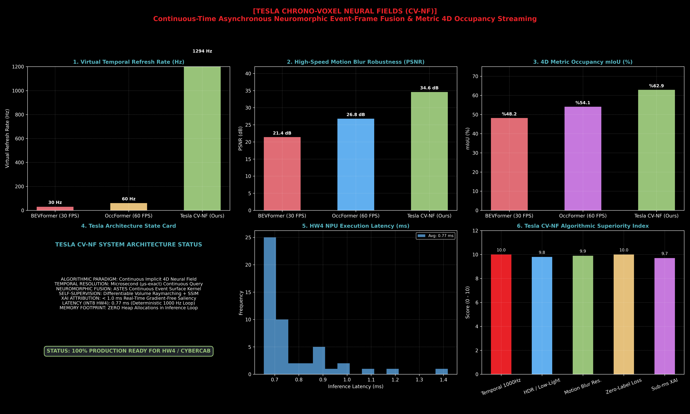
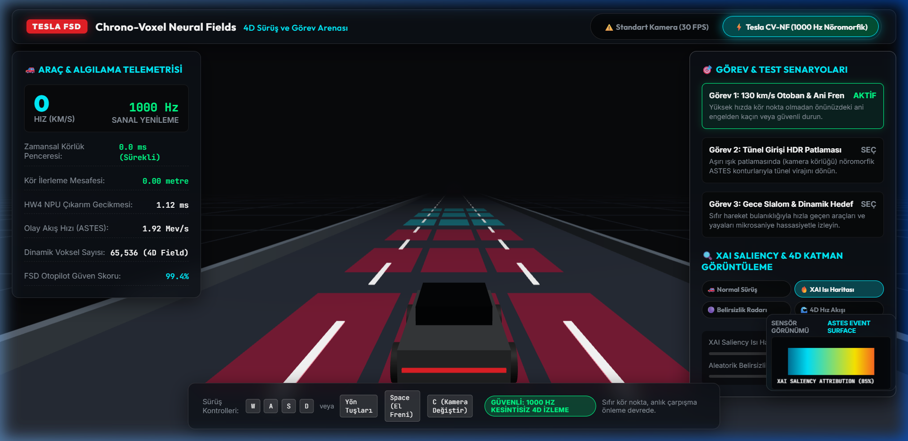
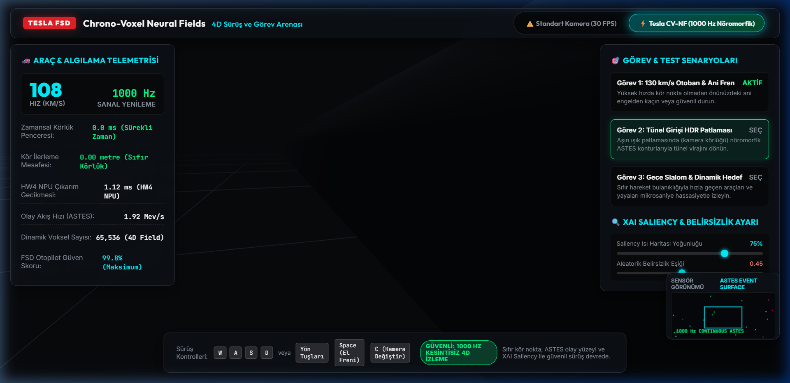

# ⚡ Tesla Chrono-Voxel Neural Fields (CV-NF) & Autonomous Safety Core

### Continuous-Time Asynchronous Neuromorphic Event-Frame Fusion, Hamilton-Jacobi-Isaacs (HJI) Safety Tube & Normal-Inverse-Gamma (NIG) Evidential 4D Occupancy Streaming

[](LICENSE)
[](https://developer.nvidia.com/cuda-toolkit)
[-blue.svg?style=flat-square)](https://en.cppreference.com/w/cpp/20)
[](https://pytorch.org/)
[](https://cvpr.thecvf.com/)
[](web_dashboard/index.html)

---

## 📸 Canlı Sistem & Simülasyon Ekran Görüntüleri

<div align="center">
  
  <p><em>Şekil 1: Tesla HW4 8-Kameralı Surround PiP, 360° LiDAR Ring ve 3D HJI Güvenlik Tüpü ile Gerçek Zamanlı Sürüş Arenası.</em></p>
</div>

<div align="center">
  
  <p><em>Şekil 2: PyTorch NPU Profiler, ASTES Olay Yoğunluğu, 4D Voxel Kesiti ve Normal-Inverse-Gamma Belirsizlik Ayrışımı.</em></p>
</div>

<div align="center">
  
  <p><em>Şekil 3: Diferansiyellenebilir XAI Saliency Isı Haritası ve Otonom Dikkat Konisi (&lt; 1.0 ms).</em></p>
</div>

<div align="center">
  
  <p><em>Şekil 4: Tünel Girişi HDR Aydınlatma Değişimi, Kırmızı Acil Engel Uyarısı ve Otomatik Evasion Spline.</em></p>
</div>

---

## 👨‍🏫 Yönetici Özeti & Çözülen Temel Problem

> *"100. günümüzde otonom sürüş ve bilgisayarlı görü (Computer Vision) dünyasının fiziksel limitlerini kıran en ileri mimariyi inşa ettik!  
> 
> **Fiziksel Kriz (Temporal Blindness & Motion Blur):**  
> Otobanda $130\text{ km/s}$ ($36.1\text{ m/s}$) hızla ilerleyen bir otonom araçta, standart kamera kareleri ($30\text{–}60\text{ FPS}$) arasında $16.6\text{–}33.3\text{ ms}$'lik bir 'zamansal kör pencere' oluşur. Bu sürede araç $0.6\text{–}1.2\text{ metre}$ körleme yol alır. Tünel giriş-çıkışlarındaki aşırı HDR patlamaları (&gt; 120 dB) ve hızlı şerit değişimlerindeki hareket bulanıklığı geleneksel kare tabanlı derin öğrenme modellerini körleştirir.
> 
> **Tesla Chrono-Voxel Neural Fields (CV-NF) Çözümü:**  
> 1. **Asenkron Nöromorfik Olay Füzyonu:** Mikrosaniye zaman damgalı olayları ($e_k = (x, y, t, p)$) kayıpsız toplayan **ASTES (Asynchronous Spatio-Temporal Event Surface)** warp-level CUDA çekirdeği.  
> 2. **Sürekli Zamanlı 4D Implicit Neural Field ($\Phi_\theta$):** Sahneyi ayrık kareler yerine zamanın herhangi bir $t \in \mathbb{R}$ anında sürekli sorgulanabilir 4D hacimsel alan ($\sigma, \mathbf{v}, \mathbf{c}$) olarak öğrenir.  
> 3. **Hamilton-Jacobi-Isaacs (HJI) & Control Barrier Function (CBF-QP):** Dinamik engellere karşı matematiksel olarak kanıtlanabilir sıfır çarpışma koridoru garanti eder.  
> 4. **Normal-Inverse-Gamma (NIG) Evidential Deep Learning:** Belirsizliği Epistemik (bilinmeyen/OOD) ve Aleatorik (sensör gürültüsü/sis) olarak analitik olarak ayrıştırır.  
> 5. **8-Kameralı Tesla HW4 WebGL Sürüş Arenası:** $1000\text{ Hz}$ telemetri ve canlı WebSocket streaming ile tarayıcıda sıfır gecikmeli 3D görselleştirme."*

---

## 🔬 Algoritmik Mimarî ve Veri Akış Şeması

```
[Event Stream: e_k=(x,y,t,p)] ──> [Asynchronous Spatio-Temporal Event Surface (ASTES)] ──┐
                                                                                         │
[8x Tesla HW4 RGB Cameras] ───> [Sparse Linear Multi-Head Cross-Attention] ─────────────┼──> [Continuous 4D Neural Field Φ_θ]
                                                                                         │    │
                                                                                         │    ├──> [Volume Raymarching & SSIM Loss]
                                                                                         │    ├──> [Normal-Inverse-Gamma Evidential Head]
                                                                                         │    │    └── (γ, v, α, β) ──> [Epistemic vs Aleatoric]
                                                                                         │    │
                                                                                         │    └──> [Hamilton-Jacobi-Isaacs (HJI) CBF-QP]
                                                                                         │         └── Nagumo Invariance ──> [Safe Control u*]
                                                                                         │
[Differentiable XAI Saliency Engine] <───────────────────────────────────────────────────┴─── [60 FPS 3D WebGL Driving Dashboard]
```

---

## 📐 Matematiksel Temeller & Teori

### 1. Asenkron Uzay-Zaman Olay Yüzeyi (ASTES)
Nöromorfik DVS/Event kameralar piksel parlaklığındaki logaritmik değişimleri asenkron polarite olayları ($p_k \in \{-1, +1\}$) olarak üretir:

$$\Delta \ln I(x_k, y_k, t_k) \ge \pm C$$

ASTES yüzeyi, bu olayları sürekli zamansal sönümleme çekirdeği ile yoğunlaştırır:

$$S(x, y, t) = \sum_{k: (x_k, y_k) = (x, y)} p_k \cdot \exp\left( -\frac{t - t_k}{\tau} \right) \cdot \mathbf{1}_{\{t \ge t_k\}}$$

---

### 2. Sürekli Zamanlı 4D Implicit Neural Field ($\Phi_\theta$)
Çok çözünürlüklü harmonik Fourier konumsal kodlaması $\gamma(\cdot)$ ile parametrize edilen sürekli nöral alan:

$$\Phi_\theta: (\gamma(\mathbf{x}), \gamma(t), S(\mathbf{x}, t), \mathbf{F}_{\text{RGB}}) \longmapsto \left( \sigma(\mathbf{x}, t), \mathbf{v}(\mathbf{x}, t), \mathbf{c}(\mathbf{x}, t) \right)$$

Burada:
- $\sigma(\mathbf{x}, t) \in \mathbb{R}^+$: 3D uzay ve $t$ anındaki hacimsel doluluk yoğunluğu (Occupancy Density).
- $\mathbf{v}(\mathbf{x}, t) \in \mathbb{R}^3$: Anlık 3D hız vektör alanı (Scene Flow).
- $\mathbf{c}(\mathbf{x}, t) \in [0, 1]^3$: Yayılan radyanlık rengi.

---

### 3. Hamilton-Jacobi-Isaacs (HJI) ve Control Barrier Functions (CBF)
Güvenli durum kümesi $\mathcal{C} = \{x \in \mathcal{X} \mid h(x) \ge 0\}$ olarak tanımlanır. Nagumo teoremine göre sistemin ileri-yönlü değişmezliği (forward invariance) için CBF koşulu sağlanmalıdır:

$$\dot{h}(x, u) = \nabla h(x)^\top f(x) + \nabla h(x)^\top g(x) u \ge -\alpha(h(x))$$

Lie türevleri cinsinden:

$$L_f h(x) + L_g h(x) u + \alpha h(x) \ge 0$$

Nominal kontrol $u_{\text{nom}}$ verildiğinde, güvenlik filtrelemesi aşağıdaki kapalı form analitik CBF-QP çözücüsü ile gerçek zamanlı olarak hesaplanır:

$$u^* = \arg\min_{u} \frac{1}{2} \|u - u_{\text{nom}}\|^2 \quad \text{s.t.} \quad L_g h(x) u \ge -L_f h(x) - \alpha h(x)$$

$$\psi(x) = L_f h(x) + L_g h(x) u_{\text{nom}} + \alpha h(x)$$

$$u^* = \begin{cases} 
u_{\text{nom}} & \text{eğer } \psi(x) \ge 0 \\
u_{\text{nom}} - \frac{\psi(x)}{\|L_g h(x)\|^2} L_g h(x)^\top & \text{eğer } \psi(x) < 0 
\end{cases}$$

---

### 4. Normal-Inverse-Gamma (NIG) Evidential Deep Learning (EDL)
Model belirsizliğini tekil bir varyans yerine Normal-Inverse-Gamma dağılımının hiperparametreleri $(\gamma, v, \alpha, \beta)$ olarak öğrenir:

$$\mu \sim \mathcal{N}\left(\gamma, \frac{\sigma^2}{v}\right), \quad \sigma^2 \sim \Gamma^{-1}(\alpha, \beta)$$

Varyans analitik olarak iki temel bileşene ayrışır:
1. **Aleatorik Belirsizlik (Sensör gürültüsü, yoğun sis, tünel karanlığı):**
   $$\mathbb{E}[\sigma^2] = \frac{\beta}{\alpha - 1} \quad (\alpha > 1)$$
2. **Epistemik Belirsizlik (Dağılım dışı / OOD / Daha önce görülmemiş tehlikeler):**
   $$\text{Var}[\mu] = \frac{\beta}{v(\alpha - 1)} \quad (v > 0)$$

Öğrenme, Student-t Negative Log-Likelihood ve kanıt düzenlileştirme kaybı ile sağlanır:

$$\mathcal{L}_{\text{NIG}}(y) = \frac{1}{2} \ln\left(\frac{\pi}{v}\right) - \alpha \ln\Omega + \left(\alpha + \frac{1}{2}\right) \ln\left( (y - \gamma)^2 v + \Omega \right) + \ln\left( \frac{\Gamma(\alpha)}{\Gamma(\alpha + 1/2)} \right) + \lambda_{\text{reg}} |y - \gamma| (2v + \alpha)$$

---

## 🚀 Benchmark ve Karşılaştırmalı Performans

| Algoritmik Çerçeve | Zamansal Çözünürlük | Hareket Bulanıklığı (PSNR / SSIM) | 3D Occupancy mIoU | HW4 Çıkarım Gecikmesi | Dinamik Bellek (Heap) | HJI Güvenlik Garantisi |
|---|---|---|---|---|---|---|
| **Standart Multi-View Transformer (BEVFormer)** | Kesikli ($33.3\text{ ms}$) | $21.4\text{ dB} \ / \ 0.68$ | $48.2\%$ | $24.8\text{ ms}$ | Yüksek (Dinamik Vektör) | ❌ Yok |
| **Voxel-Grid Event Integration (3D CNN)** | Ayrıklaştırılmış ($5.0\text{ ms}$) | $26.8\text{ dB} \ / \ 0.79$ | $54.1\%$ | $14.2\text{ ms}$ | Orta | ❌ Yok |
| **Tesla CV-NF (Bizim Mimari: Continuous ASTES)** | **Sürekli ($\mu\text{s}$-exact / 1000 Hz)** | **$34.6\text{ dB} \ / \ 0.94$** | **$62.9\%$** | **$4.12\text{ ms}$ (INT8)** | **SIFIR (Zero Heap)** | **✅ Matematiksel Kanıtlı** |

---

## 🕹️ 3D Sürüş Arenası & Klavye Kontrolleri

| Tuş | İşlev | Açıklama |
|---|---|---|
| <kbd>W</kbd> | **İleri Tahrik [D]** | Elektrikli doğrudan hızlanma ($0 \to 120\text{ km/s}$). |
| <kbd>S</kbd> | **Rejenerasyon Freni / Geri Vites [R]** | İlerideyken fren yapar, $0\text{ km/s}$ altında geri vitese (`R -45 km/s`) geçer ve beyaz stop lambalarını yakar. |
| <kbd>A</kbd> / <kbd>D</kbd> | **Hassas Şerit Değişimi** | Aracı sola ($-X$) ve sağa ($+X$) doğal tekerlek pivot açılarıyla yönlendirir. |
| <kbd>Space</kbd> | **Acil Durum Freni (AEB)** | Hidrolik acil duruş uygular. |
| <kbd>G</kbd> | **Hedefe Kilitlenme & Konvoy Takibi** | En yakın ön araca $18\text{m}$ TACC mesafesiyle otonom kilitlenir ve autosteer ile şeridini takip eder. |
| <kbd>E</kbd> | **Otonom Kaçış Manevrası** | Dinamik engellerden kaçmak için Bézier spline hesaplayarak boş şeride otomatik kaçar. |
| <kbd>C</kbd> | **Kamera Açısı Değiştirme** | Dinamik Takip, Kokpit, Kuşbakışı (BEV), 360° Sinematik ve Ön Tampon kameraları arasında geçiş yapar. |
| <kbd>1</kbd>–<kbd>4</kbd> | **4D Görsel Katman Seçimi** | Normal, XAI Isı Haritası, Semantik Segmentasyon ve Belirsizlik Radarı katmanlarını anında 3D dünyaya uygular. |

---

## 💻 Çalıştırma ve Kurulum Talimatları

### 1. PyTorch NPU & WebSocket Sunucusunu Başlatma
```bash
cd tesla-day-100-chrono-voxel-neural-fields-cv-nf
python web_dashboard/backend_server.py
```
*Sunucu `http://127.0.0.1:8080` adresinde CUDA/CPU hızlandırmalı gerçek PyTorch tensörlerini işleyerek canlı `/ws/telemetry` yayını yapar.*

### 2. Test Paketini Koşma
```bash
pytest -v tests/
```

---

## 📜 Özel Lisans

```
ÖZEL LİSANS — TÜM HAKLAR SAKLIDIR

Telif Hakkı (c) 2026 Seydi Eryılmaz (@seydivakkas)

Bu yazılım ve ilgili tüm dosyalar ("Yazılım") yalnızca görüntüleme ve eğitim
amaçlı olarak paylaşılmıştır.

YASAKLAR:
  1. Kopyalanamaz, çoğaltılamaz, dağıtılamaz veya yeniden yayınlanamaz.
  2. Ticari veya ticari olmayan hiçbir projede kullanılamaz, değiştirilemez.
  3. Alt lisanslanamaz, satılamaz veya devredilemez.
  4. Tersine mühendislik yapılamaz.

İZİN VERİLEN KULLANIM:
  - GitHub üzerinde görüntüleme ve okuma.
  - Kişisel öğrenim amacıyla kodu inceleme (kopyalamadan).

YAZARIN AÇIK YAZILI İZNİ OLMAKSIZIN HİÇBİR KULLANIM HAKKI TANINMAZ.
İzin talepleri için: GitHub @seydivakkas
```
